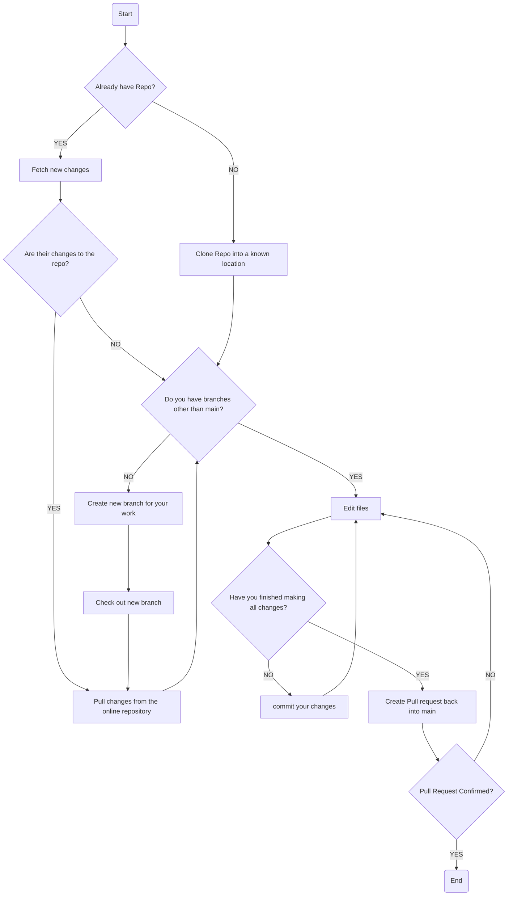

# Software Design and Development Notes
## 🚀🚀  Welcome 🚀🚀

The software design and development notes repository is used to store notes regarding the SDD course.
It is also used as a guide and learning environment for using Git and GitHub.
There are some rules when committing to this repository, and they should be followed, otherwise,
your notes will not be merged into the main reposititory. 

## If you're commiting to this repository introduce yourself here:
- HFoxwell 🦊 -> I'm the owner of this repo welcome 🙋‍♂️  
 
- ESachdev 🐐 -> Whats goodie my gang?

- Aaditya ⌨️ -> i don't use an android...
## 🏢 Project Structure 🏢
- Readme.md ➡️ This document is to seek instruction on how to use this repository.
- 9.1 |  
      | - 9.1.1 ➡️ Social and ethical  
      |   - The social and ethical issues regarding to SDD course.
      |  
      | - 9.1.2 ➡️ Application of software Development approaches  
      |   - The variations of the software Development lifecycle, and installation methods.  

- 9.2 |  
      | - 9.2.1 ➡️ Defining and understanding the problem  
      |   - Planning and understanding the problem at hand, with a focus on preparation.   
      |   
      | - 9.2.2 ➡️ Planning and Designing software solutions  
      |   - Planning the programatic steps to produce software to target the solution.  
      |   
      | - 9.2.3 ➡️ Implementation of software solution  
      |   - The development of the software solution, including development documentation.  
      |  
      | - 9.2.4 ➡️ Testing and Evaluating of software solutions  
      |   - Using standard methods to verify the integrity and quality of a software solution.  
      |  
      | - 9.2.4 ➡️ Maintaining software solutions  
      |   - Digesting the information from testing, combining it with client feedback and   
      |     redefining the software solution requirements.  

- 9.3 |  
      | - Specalist considerations for creating a major project. Developing a software package  
      |   for real world use.  

- 9.4 |  
      | - 9.4.1 ➡️ Programming Paradigms  
      |   - The development and use of different programming styles, along with their benefits  
      |     and drawbacks.  

---

## Using Git with Notes

Git and GitHub allow you download, update, and make changes to the notes which are on the 
repository. As mentioned, above there are processes and rules when using this repository. 
The common commands and the rules are listed below:

### Git commands

🔴 `git clone <repo>`   ➡️ allows you to clone a new repository. So long as you have access.  
🔴 `git fetch --all`    ➡️ makes git aware of changes in all of your repositories, remote or local.  
🔴 `git pull`           ➡️ will download changes from the online repositor.  
🔴 `git branch <name>`  ➡️ creates a new branch to keep changes separate.  
🔴 `git merge <branch>` ➡️ move changes from one branch to another.  
🔴 `git push`           ➡️ push changes to the remote repository.  

### 👮‍♀️ Rules 👮‍♀️

When using git to commit notes to the repository, there are special considerations you must make. There may be multiple people editing the repositiory, so it is good Git ettiqutee to make sure you pull, and push in a clean manner.  
To achieve this, these are the simple rules to follow:  

### **Rules to follow**

1. If you don't have a copy of the repository, clone it into a new directory. Somewhere you are able to edit it effectivly.
2. Make sure you `git fetch --all` before you edit any files. This will inform you of all changes. 
3. If there are changes, make sure you pull the latest version from the repository. 
4. When pulling from the repo, use the `git pull --all` command. It will pull changes for all repositories. 
5. Make sure you make a new branch before you make any changes. **No changes will be allowed to be committed to the MAIN branch.** 
6. Commit your code regularly. Make sure you make a commit using `git commit` before you change files, or after each time you save a file. 

Once you have finished your changes. You can make a _**Pull Request**_. Which allows you to merge your changes to the **MAIN** branch.

## Rule Flowchart

## 🔥🔥 GitHub Desktop 🔥🔥

The command line can be difficult navigate, and because of this, it can be easier for you to use an alternate program -- Such as, GitHub desktop.  
This can be found at [https://desktop.github.com/].  
This program can be used to achieve all the above functions, using a Graphical user interface. It will also allow you to view the conflicts and make changes to how you commit your files. This will make the process much easier. 

You should still follow the rules that have been outlined above. They are critical to making sure that will not cause major issues with the repository, and allow others to edit files easily. 
